# Software Design Document (SDD)
# ThreeDOS Management System

---

| Field | Value |
|---|---|
| **Document Version** | 2.0 |
| **Status** | Final |
| **Last Updated** | 2026-07-27 |
| **Framework** | Laravel 12.x |
| **Primary Language** | PHP |
| **Deployment** | Railway |

## 1. System Overview

ThreeDOS-APIs is a backend-only REST API built with Laravel. The codebase uses a layered architecture:

- Routes define the external API surface.
- Middleware handles JWT auth, throttling, and response caching.
- Controllers coordinate requests and responses.
- Request classes enforce validation and authorization checks.
- Services implement application behavior.
- Repositories encapsulate persistence logic.
- Policies enforce role and council access rules.
- Resources and collections shape the response payloads.

The system is designed around council isolation and role-based access control.

## 2. Runtime Architecture

```mermaid
graph TD
    Client[Client / Postman / Frontend] --> Routes[Laravel api.php]
    Routes --> Auth[auth:api + throttle middleware]
    Auth --> Controllers[API Controllers]
    Controllers --> Requests[Form Requests + Policies]
    Controllers --> Services[Application Services]
    Services --> Repositories[Repository Layer]
    Repositories --> Models[Eloquent Models]
    Models --> DB[(Database)]
    Controllers --> Cache[CacheService / Redis]
    Controllers --> Gemini[GeminiService]
```



## 3. Technology Stack

| Area | Technology |
|---|---|
| Framework | Laravel 12 |
| Auth | JWT via `tymon/jwt-auth` |
| Cache | Redis |
| AI | Google Gemini via `Gemini\Laravel` |
| Notifications | Laravel notifications |
| Imports | Spreadsheet upload support through import classes |
| API Style | REST JSON |

## 4. Route Surface

The API surface is defined in `routes/api.php` and includes:

- `/login`
- `/logout`
- `/forget-password`
- `/me`
- `/instance`
- `/users/dashboard`
- `/notifications`
- `/ai-chat`
- Resource routes for councils, users, roles, tasks, sessions, attendances, task-submissions, teams, and team-members
- Cache admin routes under `/cache`
- Bulk routes for users, team-members, and attendances

## 5. Request Pipeline

1. Request enters `api.php`.
2. JWT auth and throttle middleware run where required.
3. FormRequest objects validate input and sometimes also enforce authorization.
4. Controllers call the relevant service.
5. Services apply business rules and council scoping.
6. Repositories interact with the database.
7. Controllers return a standardized success/error envelope.

## 6. Standard Response Pattern

Most endpoints return a JSON envelope with this shape:

```json
{
  "status": "success",
  "message": "...",
  "data": null
}
```

Collection endpoints usually return a paginated payload with `data`, `links`, and `meta`.

## 7. Domain Model

### 7.1 Entities

| Entity | Purpose |
|---|---|
| User | Authenticated actor and business participant |
| Role | Access control role assigned to a user |
| Council | Parent organizational boundary |
| CouncilSession | Meeting/session under a council |
| Task | Work item linked to a session |
| TaskSubmission | Submitted work for a task |
| Team | Council team grouping |
| TeamMember | Membership record inside a team |
| Attendance | Attendance entry for a session |

### 7.2 Business Relationships

- A user belongs to a council and has one role.
- A council has many sessions, teams, users, tasks, attendances, and submissions through session/task links.
- A session belongs to a council.
- A task belongs to a session.
- A task submission belongs to a task and a user.
- A team belongs to a council.
- A team member belongs to a team and a user.
- Attendance belongs to a user and a council session.

## 8. Authorization Design

Authorization is implemented through a combination of policies and request-level checks.

| Resource | Main Rule |
|---|---|
| Council | Head, Instructor, VicePresident, President, and some HR flows can create or manage depending on operation |
| User | Head, Instructor, VicePresident, President can manage; Delegate can update self only |
| Session | Head, Instructor, VicePresident, President can create; council checks apply on writes |
| Task | Head, Instructor, VicePresident, President can create/manage; council must match for non-global users |
| Task Submission | Delegates can create own submissions; council admins can manage council submissions |
| Team | Council admins can create/manage; delegates can only view or interact where policy allows |
| Team Member | Council admins can create and manage |
| Attendance | Council admins and HR can manage; delegates can create attendance in the current policy set |

## 9. Core Business Logic

### 9.1 Council Scoping

The main business rule is that almost every list or write operation is scoped to the authenticated user’s council unless the user is VicePresident or President.

### 9.2 Task Submission Protection

TaskSubmissionService ensures a delegate cannot submit for another council. It checks both the task’s council and the target user’s council before creating the record.

### 9.3 Dashboard Behavior

The dashboard endpoint is role-aware:

- Delegates receive only their own data.
- HR, Instructor, Head, VicePresident, and President can request broader dashboard data.

### 9.4 AI Mentor Behavior

Gemini is wrapped in a system prompt that forces guided answers, simplified explanations, and refusal of final-answer generation.

### 9.5 Cache Behavior

The CacheService provides key patterns for:

- Endpoint cache entries
- User-specific cache entries
- Resource cache invalidation
- Cache stats inspection

Write operations clear related resource caches immediately after persistence.

## 10. Data Design Notes

### 10.1 Status Values

- Task status in the code is modeled around lifecycle values such as `Pending`, `In Progress`, and `Completed`.
- Submission status uses `submitted` and grading-related states in service logic.
- Attendance status uses `present`, `absent`, and `late`.

### 10.2 Import Formats

- User import supports Excel and CSV.
- Attendance import supports Excel.
- Team-member bulk import accepts structured JSON.

## 11. Operational Components

### 11.1 Cache Controller

Provides support endpoints for stats and manual cache cleanup by endpoint, resource, or user.

### 11.2 Notifications

Notifications are exposed as a cached authenticated endpoint, returning the current user’s notification collection.

### 11.3 Instance Endpoint

The `/instance` endpoint returns the current host name and is used for deployment verification.

## 12. Design Constraints

- The project is backend-only.
- Business rules are implemented primarily in service and policy layers.
- The API returns JSON only.
- Redis is required for cache behavior to match the intended design.
| council_id | UUID | FK -> councils | Denormalized for fast querying |
| status | Enum | present/absent/late | Attendance status |

---

## 4. Application Layer Design

### 4.1 Controller Layer

Controllers are thin. They only:
1. Validate the incoming request (via Form Request classes)
2. Call the appropriate Service method
3. Return a JSON response using the `ApiResponse` trait

All controllers use the `ApiResponse` trait which provides:
- `successResponse($data, $message, $code)`
- `errorResponse($message, $code, $errors)`
- `createdResponse($data, $message)`
- `noContentResponse($message)`
- `unauthorizedResponse($message)`
- `forbiddenResponse($message)`
- `notFoundResponse($message)`
- `validationErrorResponse($errors, $message)`

**Controllers List:**
| Controller | Resource | Special Actions |
|---|---|---|
| AuthController | /login, /logout, /me, /forget-password | - |
| UserController | /users | BulkStore, dashboard |
| CouncilController | /councils | - |
| CouncilSessionController | /sessions | - |
| TaskController | /tasks | - |
| TaskSubmissionController | /task-submissions | - |
| TeamController | /teams | - |
| TeamMemberController | /team-members | storeBulk |
| AttendanceController | /attendances | bulkStore |
| RoleController | /roles | - |
| CacheController | /cache/* | stats, clearEndpointCache, clearResourceCache, clearUserCache |
| AiChatController | /ai-chat | chat |

### 4.2 Service Layer

Services hold all business logic. They are injected into controllers via constructor dependency injection.

| Service | Responsibility |
|---|---|
| AuthService | JWT generation, login validation, logout, password reset |
| UserService | User CRUD with cache invalidation, bulk import processing |
| CouncilService | Council CRUD, scoped queries |
| CouncilSessionService | Session CRUD, session-council association |
| TaskService | Task CRUD, session linking |
| TaskSubmissionService | Submission CRUD, file upload handling, grade assignment |
| TeamService | Team CRUD, council scoping |
| TeamMemberService | Member assignment, bulk member processing |
| AttendanceService | Attendance CRUD, bulk attendance import |
| RoleService | Role management |
| CacheService | All Redis operations (get, put, remember, rememberPaginated, forget, forgetByPattern, clearUserCache, clearResourceCache, getStats) |
| GeminiService | AI chat via Gemini 2.5 Flash, prompt-engineered for mentor-only behavior |

### 4.3 Repository Layer

Repositories isolate all raw database queries from business logic.

| Repository | Responsibility |
|---|---|
| UserRepository | User queries (search, filter by council, bulk insert) |
| CouncilRepository | Council queries with pagination and search |
| CouncilSessionRepository | Session queries scoped to council |
| TaskRepository | Task queries with council scope and search |
| TaskSubmissionRepository | Submission queries, grade updates, role-based filtering |
| TeamRepository | Team queries scoped to council |
| TeamMemberRepository | Member queries, role assignment |
| AttendanceRepository | Attendance queries per session and per user |
| RoleRepository | Simple role lookup |

### 4.4 Request Validation Layer

Form Request classes enforce input validation before controllers receive data.

**Organized by domain:**
- `UserRequests/` — StoreUserRequest, UpdateUserRequest, BulkUserRequest
- `CouncilRequests/` — StoreCouncilRequest, UpdateCouncilRequest
- `SessionRequests/` — StoreSessionRequest, UpdateSessionRequest
- `TaskRequests/` — StoreTaskRequest, UpdateTaskRequest
- `TaskSubmissionRequests/` — StoreTaskSubmissionRequest, UpdateTaskSubmissionRequest
- `AttendanceRequests/` — StoreAttendanceRequest, BulkAttendanceRequest
- `StoreTeamRequest`, `UpdateTeamRequest`
- `StoreTeamMemberRequest`, `UpdateTeamMemberRequest`, `BulkTeamMemberRequest`
- `PaginatedRequest` — shared pagination query params (pageIndex, pageSize, search)

---

## 5. Security Design

### 5.1 Authentication Flow

```
1. Client sends POST /api/login with {email, password}
2. AuthController -> AuthService validates credentials
3. On success, AuthService generates JWT via tymon/jwt-auth
4. Token stored in users.access_token column
5. Client uses token: Authorization: Bearer <token>
6. auth:api middleware validates token on every protected route
7. On logout, token is invalidated (JWT blacklisted + column cleared)
```

### 5.2 Rate Limiting

- **Global**: 60 requests per minute per user (throttle:60,1)
- **AI Chat**: 20 requests per minute AND 100 requests per 12 hours (throttle:20,1 + throttle:100,720)

### 5.3 Data Isolation

Council-scoped data isolation is enforced at two levels:

**Level 1: Repository queries**
- Every query includes `->where('council_id', auth()->user()->council_id)` unless role is VP/President.

**Level 2: Form Request validation**
- Write requests (e.g., StoreTeamRequest) validate that the submitted council_id matches `auth()->user()->council_id`.

### 5.4 Authorization (RBAC)

Authorization is enforced via Laravel Policies. Key rules:

| Action | Allowed Roles |
|---|---|
| Create Council | VP, President |
| Delete Council | VP, President |
| Create Task | Head, Instructor, VP, President |
| Grade Submission | Instructor, Head, VP, President |
| Manage Users | Head, HR, VP, President |
| View All Councils | VP, President only |
| Use AI Chat | All authenticated roles |

---

## 6. Caching Design

### 6.1 Response Cache Middleware

The `CacheResponse` middleware intercepts GET requests and:
1. Generates a unique cache key from: `user_id + HTTP method + full URI + query string`
2. Checks Redis for a cached response
3. On cache miss: executes the controller, caches the JSON response
4. On cache hit: returns cached response directly (skipping controller + DB)

### 6.2 Cache TTLs

| Resource | TTL |
|---|---|
| Councils, Users, Roles, Tasks, Sessions, Attendances, Submissions | 1800s (30 min) |
| Teams, Team Members | 3600s (60 min) |
| Notifications | 1800s (30 min) |
| Dashboard | 1800s (30 min) |

### 6.3 Cache Invalidation

Cache is invalidated by the CacheService using Redis pattern matching:

- **Per-user**: `endpoint_cache:user:{userId}:*` and `user:{userId}:*`
- **Per-resource**: `endpoint_cache:*:uri:*{resource}*`
- **All endpoints**: `endpoint_cache:*`

### 6.4 Redis Key Namespaces

| Prefix | Purpose |
|---|---|
| `endpoint_cache:` | Response cache per user+URI |
| `user:` | User-specific data cache |
| `rate_limit:` | Rate limiting counters |

---

## 7. AI Integration Design

### 7.1 GeminiService

- Uses `google-gemini-php/laravel` SDK connecting to Google Gemini 2.5 Flash model.
- Accepts a user message string.
- Prepends a detailed system prompt that enforces mentor-only behavior.

### 7.2 AI Behavioral Constraints (System Prompt Rules)

- Only answers questions relevant to council session material (backend, frontend, business, marketing).
- Refuses to provide complete solutions or finished deliverables.
- Never uses asterisks (*) in responses (formatting constraint).
- Always breaks answers into logical steps.
- Encourages critical thinking with guiding questions.
- Provides small illustrative examples only when necessary, never full solutions.

### 7.3 Rate Limiting for AI

Stricter rate limits protect API cost:
- 20 requests per 1 minute
- 100 requests per 12 hours (720 minutes)

---

## 8. Error Handling Design

### 8.1 Global Exception Handler

`ApiExceptionHandler` centralizes all exception-to-response mapping:

| Exception Type | HTTP Status | Response Message |
|---|---|---|
| ModelNotFoundException | 404 | Resource not found |
| NotFoundHttpException | 404 | Resource not found |
| AuthenticationException | 401 | Unauthenticated |
| ValidationException | 422 | Validation Error (with field errors) |
| HttpException | Dynamic | Exception message |
| Any other Throwable | 500 | Server Error |

### 8.2 Error Logging

All exceptions are logged to the `api_errors` channel with full context:
- HTTP status code
- Exception class and message
- File and line number
- Full stack trace
- Request URL, method, and input (passwords excluded)
- Authenticated user ID and name

### 8.3 Standard Error Response Format

```json
{
  "status": "failed",
  "message": "Error message here",
  "errors": {
    "field": ["Validation message"]
  }
}
```

---

## 9. File Upload Design

- Task submissions accept file uploads (multipart/form-data).
- Files are stored via League Flysystem abstraction supporting both local storage and AWS S3.
- File path/URL is stored in `task_submissions.file`.
- Attendance and User bulk imports accept Excel/CSV files processed via import classes in `app/Imports/`.

---

## 10. Notification Design

- Database notifications are stored in Laravel's standard `notifications` table.
- Notifications are delivered to users on relevant events (task assignment, grading, etc).
- The `/notifications` endpoint returns the authenticated user's notifications.
- Responses are cached for 30 minutes to reduce DB load.

---

## 11. Observability

- **Laravel Telescope** is installed for development and staging monitoring.
- Captures: requests, responses, queries, jobs, exceptions, logs, cache operations.
- Access at: `/telescope` (protected, dev/staging only).

---

## 12. Deployment

| Component | Platform |
|---|---|
| API Application | Railway (Cloud PaaS) |
| Database | Railway MySQL/PostgreSQL addon |
| Redis | Railway Redis addon |
| File Storage | AWS S3 |
| Email | MailerSend |

**Environment Variables Required:**
- `APP_KEY`, `APP_ENV`, `APP_URL`
- `DB_CONNECTION`, `DB_HOST`, `DB_PORT`, `DB_DATABASE`, `DB_USERNAME`, `DB_PASSWORD`
- `REDIS_HOST`, `REDIS_PORT`, `REDIS_PASSWORD`
- `JWT_SECRET`
- `GEMINI_API_KEY`
- `MAILERSEND_API_KEY`, `MAIL_FROM_ADDRESS`, `MAIL_FROM_NAME`
- `AWS_ACCESS_KEY_ID`, `AWS_SECRET_ACCESS_KEY`, `AWS_DEFAULT_REGION`, `AWS_BUCKET`

---

*Document maintained by the ThreeDOS Engineering Team.*
