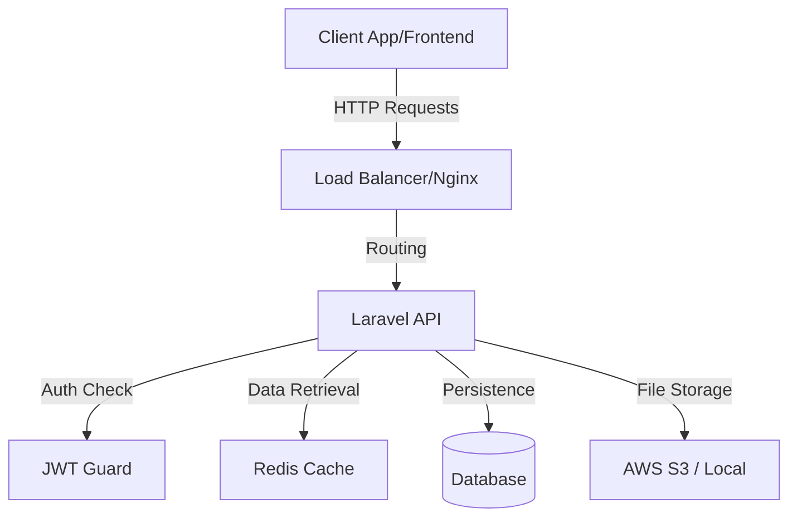
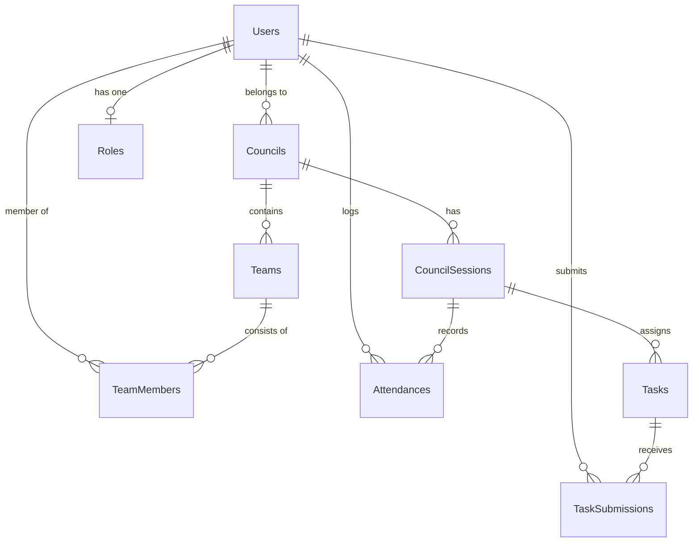

# Software Requirements Specification (SRS) - ThreeDOS Management System

**Version:** 2.0
**Status:** Draft
**Last Updated:** 2026-02-07

---

## 1. Introduction
This document provides the complete technical specification for the ThreeDOS-APIs backend. It details the system architecture, database schema, API contracts, and security mechanisms implemented in the Laravel application.

## 2. System Architecture

### 2.1 Tech Stack
*   **Framework**: Laravel 12.x (PHP 8.2+)
*   **Database**: MySQL / PostgreSQL (Production)
*   **Caching**: Redis (Key-Value Store)
*   **Authentication**: JWT (JSON Web Tokens) via `tymon/jwt-auth`
*   **Server**: Nginx / Apache
*   **Queue Driver**: Redis (for asynchronous jobs)

### 2.2 System Diagram


## 3. Database Design

### 3.1 Entity Relationship Diagram (ERD)


### 3.2 Schema Specifications

#### `users` Table
| Column | Type | Constraints | Description |
| :--- | :--- | :--- | :--- |
| `id` | UUID | PK | Unique identifier. |
| `name` | String | Required | Full name of the user. |
| `email` | String | Unique | Email address for login. |
| `password` | String | Hashed | Bcrypt hashed password. |
| `role_id` | UUID | FK | Reference to `roles` table. |
| `council_id` | UUID | FK, Nullable | Reference to `councils` table. |
| `access_token`| Text | Nullable | Current active JWT token. |
| `status` | Enum | 'active', 'inactive' | User account status. |

#### `tasks` Table
| Column | Type | Constraints | Description |
| :--- | :--- | :--- | :--- |
| `id` | UUID | PK | Unique identifier. |
| `title` | String | Required | Title of the task. |
| `description` | String | Required | Detailed instructions. |
| `due_date` | Date | Nullable | Deadline for submission. |
| `status` | String | Def: 'Pending' | 'Pending', 'In Progress', 'Completed'. |
| `council_session_id` | UUID | FK | Links task to a specific meeting/session. |

#### `task_submissions` Table
| Column | Type | Constraints | Description |
| :--- | :--- | :--- | :--- |
| `id` | UUID | PK | Unique identifier. |
| `task_id` | UUID | FK | Reference to parent task. |
| `user_id` | UUID | FK | Reference to student submitting. |
| `file` | String | Required | Path to uploaded file. |
| `grade` | String | Nullable | Grade assigned by instructor. |
| `comment` | String | Nullable | Feedback text. |

## 4. API Specification

### 4.1 Authentication Endpoints

#### POST `/api/login`
*   **Request Body**:
    ```json
    {
        "email": "user@example.com",
        "password": "password"
    }
    ```
*   **Response (200 OK)**:
    ```json
    {
        "status": "success",
        "message": "Login successfully",
        "data": {
            "user_name": "John Doe",
            "role": "Delegate",
            "access_token": "eyJ0eXAi...",
            "expires_in": 3600
        }
    }
    ```

### 4.2 Task Management

#### POST `/api/tasks`
*   **Authorization**: `Head` or `Instructor` of the linked Council.
*   **Validation Rules**:
    *   `title`: required, string, max:255
    *   `description`: required, string
    *   `council_session_id`: required, exists:council_sessions,id
*   **Response (201 Created)**: Returns created task object.

#### PUT `/api/tasks/{id}`
*   **Validation Rules**:
    *   `status`: in:Pending,In Progress,Completed
    *   `due_date`: date
*   **Side Effects**: Invalidates `tasks` and `task-submissions` cache keys.

### 4.3 Submission Management

#### POST `/api/task-submissions`
*   **Validation Rules**:
    *   `task_id`: required, exists:tasks,id
    *   `file`: required, string (path)
*   **Logic**: Creates a record linking user to task. Defaults status to 'Submitted'.

#### PUT `/api/task-submissions/{id}`
*   **Authorization**: Instructor (for grading) or Owner (for resubmission).
*   **Validation Rules**:
    *   `grade`: numeric
    *   `comment`: string
    *   `status`: string

### 4.4 Team Management

#### POST `/api/teams`
*   **Authorization**: `Head` or `Instructor`.
*   **Validation Rules**:
    *   `team_number`: required
    *   `council_id`: required, exists:councils,id

#### POST `/api/team-members`
*   **Validation Rules**:
    *   `team_id`: required, exists:teams,id
    *   `user_id`: required, exists:users,id
    *   `role`: in:Leader,Member,Co-Leader

## 5. Security Specification

### 5.1 RBAC (Role-Based Access Control)
Access is enforced via Policies and custom middleware logic in Controllers.

| Role | View Own | View Council | View Global | Create Tasks | Grade |
| :--- | :---: | :---: | :---: | :---: | :---: |
| Delegate | ✅ | ❌ | ❌ | ❌ | ❌ |
| Instructor | ✅ | ✅ | ❌ | ✅ | ✅ |
| Head | ✅ | ✅ | ❌ | ✅ | ✅ |
| Vice President | ✅ | ✅ | ✅ | ✅ | ✅ |
| President | ✅ | ✅ | ✅ | ✅ | ✅ |

### 5.2 Data Isolation Middleware
*   **Logic**: usage of `auth()->user()->council_id` to filter database queries.
*   **Validation**: `StoreTeamRequest` checks `auth()->user()->council_id === $this->council_id` to prevent cross-council modifications.

## 6. Error Handling
The API returns standard HTTP status codes:
*   `200`: Success
*   `201`: Created
*   `401`: Unauthorized (Invalid Token)
*   `403`: Forbidden (Role mismatch)
*   `404`: Not Found (Resource doesn't exist)
*   `422`: Validation Error (Input failed rules)
